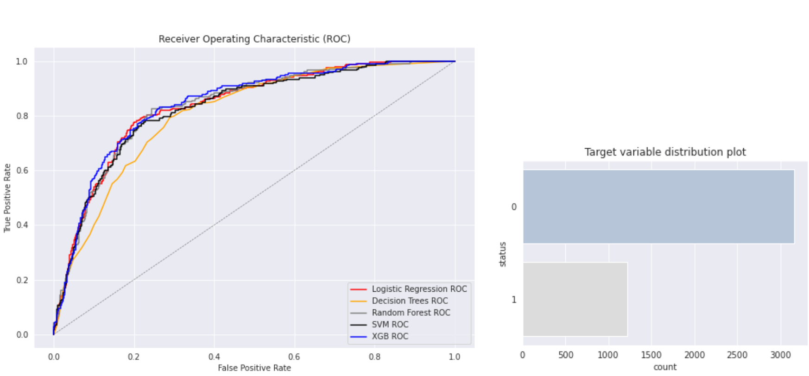
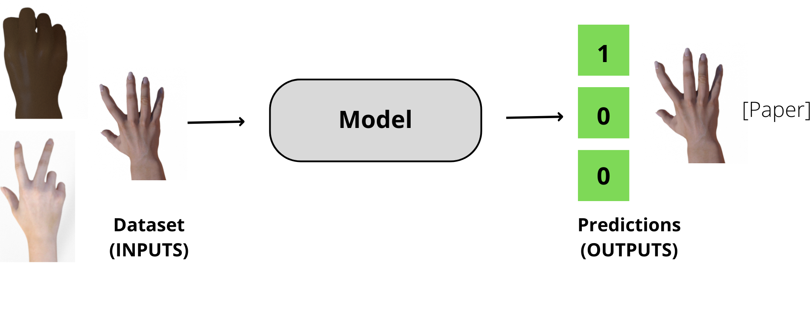

# Portfolio
---

## Data Science

### Churn Prediction

Imagine that we are working at a telecom company that offers phone and internet services, and we have a problem: some of our customers are churning. They no longer are using our services and are going to a different provider. We would like to prevent that from happening, so we develop a system for identifying these customers and offer them an incentive to stay.
  
First, I carry out a deep exploratory data analysis for analying relationships between data. Then, I preprocess the data and I do some feature engineering. Finally, I train a Logisctic Regression model selecting the best hyperparameters that fit better for the application and I analize its performance.
  

---

### Credit Risk Scoring 

Imagine that we work at a bank. When we receive a loan application, we need to make sure that if we give the money, the customer will be able to pay it back. Every application carries a risk of default, the failure to return the money. We’d like to minimize this risk: before agreeing to give a loan, we want to score the customer and assess the chances of default. If it’s too high, we reject the application.
  
First, I carry out a brief exploratory data analysis. Then, I preprocess the data and do some feature engieering. Finally, I train different machine learning models to see wich one fits better for the application: Logistic regression, Decision Trees, Random Forest, SVM and XGBoost.

  

---

### Rock-Paper-Scissors Image classification

The main goal of this proyect is to build a image classification model for the rock, paper and scissors game. 
  
First I prepare the data using generators for image augmentation. Then, I use a pretained model called Inception-v3 and we add some extra layers to fit the model for the application. For training the model I use the Rock Paper Scissors Dataset and then, the model is evaluated using unseen images.

---
## Resources

### NumPy library

NumPy is a library for adding support for large, multi-dimensional arrays and matrices, along with a large collection of high-level mathematical functions to operate on these arrays.
  
This notebook shows the main functions of the NumPy library. These are related with implementing different mathematical operations, sorting, reshaping or slicing NumPy arrays and much more.

---

### Pandas library

 

Pandas is a library used in data analysis and in data manipulation for retrieving information from the data.
  
This notebook shows the main functions of the Pandas library. These are related with creating Data Frames and Series, grouping or sorting them, dealing with missing values, and much more.

---

